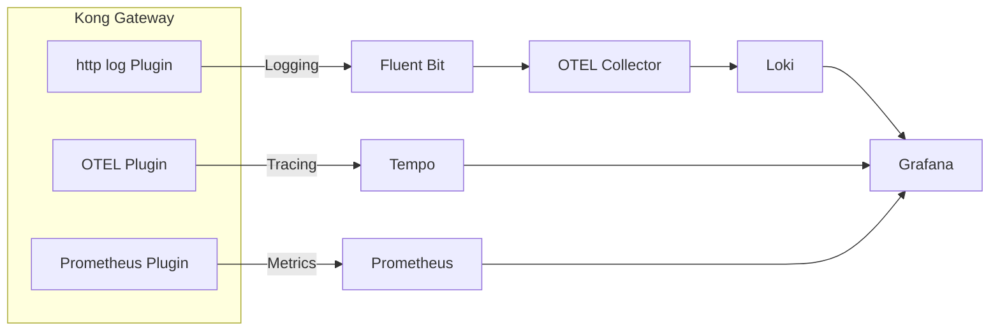

## What is this?
With Kong Gateway, you can get metrics, logs, and tracings without modifying your application.
Combined with Grafana Loki and Tempo, logs and tracings can be cross-referenced.
Using the tools in this repository, you can easily build a Docker environment for validation.

## Requirements
- Docker and Docker Compose
- [decK](https://docs.jp.konghq.com/deck/)

Also, by default, a license file is required to use Kong Gateway 3.10 or later.
You must include the path to the license file in `KONG_LICENSE_FILE` in `env.sh`.
The default path is as follows
```sh
~/.kong-license-data/license.json
```

## Components
The following components are used here.
|Component | Description |
|---|---|
|Kong Gateway|API Gateway that provides observability features such as metrics, logs, and tracing via Plugins.|
|Prometheus|A monitoring system and time series database that collects metrics from Kong Gateway.|
|Grafana|A visualization tool that displays metrics, logs, and tracings.|
|Grafana Loki|A log aggregation system that collects logs from OTEL Collector.|
|Grafana Tempo|A distributed tracing system that collects traces from Kong Gateway.|
|fluent-bit|A lightweight log processor that collects logs from Kong Gateway and sends them to OTEL Collector.|
|OpenTelemetry Collector|A collector that collects logs from fluent-bit and sends them to Grafana Loki.|


Kong's OTEL Collector can also send logs, but specifying the Loki endpoint did not interpret the logs correctly, so here they are sent through the OTEL Collector.




## How to use
1. Boot Kong Gateway, Prometheus, Grafana, Loki, Tempo, etc
```sh
./run.sh start
```
It wrap `docker-compose up` and configure Kong Gateway's Service/Route/Plugin with decK.
Multiple containers are launched after running the command, and each can be accessed as follows.
|Service|Host|
|---|---|
|Kong Gateway|http://localhost:8002|
|Prometheus|http://localhost:9090|
|Grafana|http://localhost:3000|
|httpbin (via GW)|http://localhost:8000/httpbin|

2. Run API requests
Send an API Request and record metrics, logs, and tracings by doing the following.
```sh
./run.sh test
```
Grafana will open in your browser, so you can see the following:

- Metrics
- Traces
- Logs
- The ability to navigate from traces to logs
- The ability to navigate from logs to traces

3. Stop the environment
```sh
./run.sh stop
```
